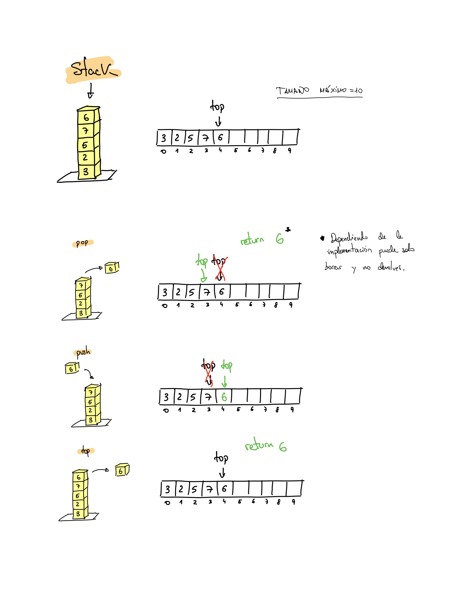
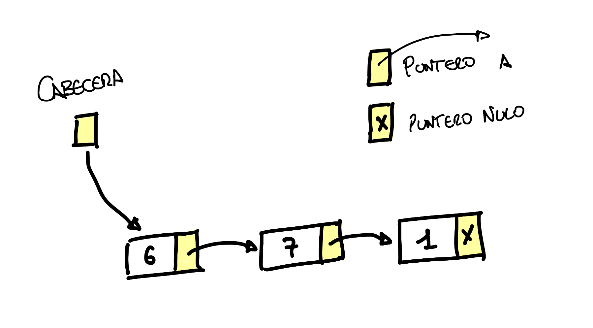
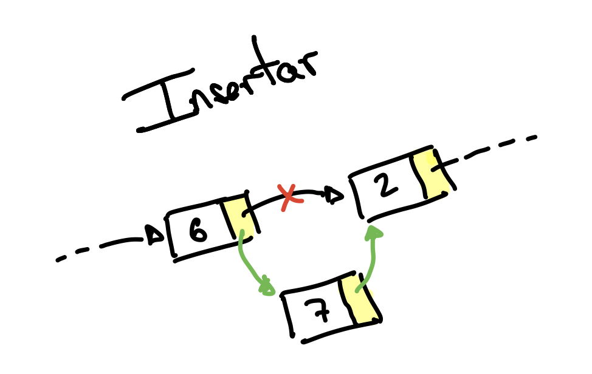
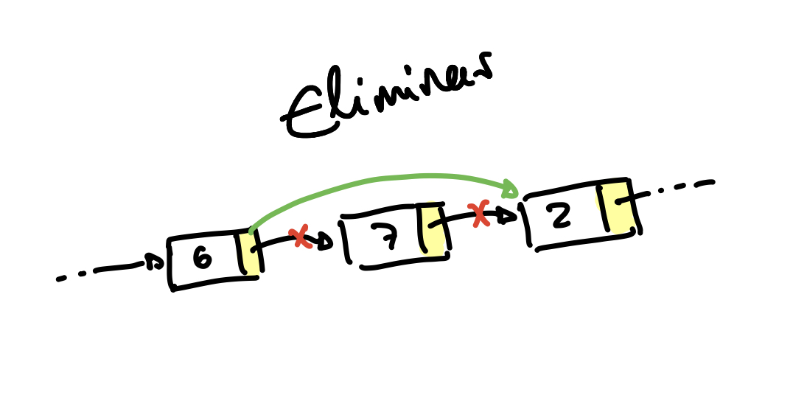
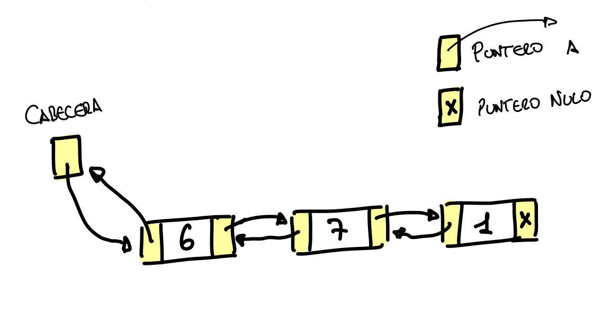

# Tema 2: Estructuras de datos

## Pilas

### Características

- Acceso limitado al último elemento insertado.
- Operaciones básicas: apilar, desapilar y cima (push, pop y top).
- Cada operación tarda O(1) independientemente del tamaño de la pila.

Representación de una pila:



### Pseudocódigo

```pseudo
tipo Pila = registro
    Cima_de_pila : 0..Tamaño_máximo_de_pila
    Vector_de_pila : vector [1..Tamaño_máximo_de_pila] de Tipo_de_elemento
fin registro

procedimiento Crear Pila (P)
    P.Cima_de_pila := 0
fin procedimiento

función Pila Vacía (P) : test
    devolver P.Cima_de_pila = 0
fin función

procedimiento Apilar (x, P)
    si P.Cima_de_pila = Tamaño_máximo_de_pila entonces
        error Pila llena
    sino
        P.Cima_de_pila := P.Cima_de_pila + 1
        P.Vector_de_pila[P.Cima_de_pila] := x
fin procedimiento

función Cima (P) : Tipo_de_elemento
    si Pila Vacía(P) entonces error Pila vacía
    sino devolver P.Vector_de_pila[P.Cima_de_pila]
fin función

procedimiento Desapilar (P)
    si Pila Vacía (P) entonces error Pila Vacía
    sino P.Cima_de_pila := P.Cima_de_pila - 1
fin procedimiento
```

### Implementación en C

```c
/* ------ headers ------- */
#define TAMANO_MAXIMO_PILA 10

typedef int tipo_elemento;
typedef struct {
    int cima;
    tipo_elemento vector[TAMANO_MAXIMO_PILA];
} pila;

void crear_pila(pila *);
int pila_vacia(pila);
void apilar(tipo_elemento, pila *);
tipo_elemento cima(pila);
void desapilar(pila *);

/* ERRORES: */
/*  -cima o desapilar sobre pila vacia */
/*  -apilar sobre la pila llena        */

/* ------ code ------- */
#include <stdlib.h>
#include <stdio.h>

void crear_pila(pila *p) {
    p->cima = -1;
}

int pila_vacia(pila p) {
    return (p.cima == -1);
}

void apilar(tipo_elemento x, pila *p) {
    if (++p->cima == TAMANO_MAXIMO_PILA) {
        printf("error: pila llena\n");
        exit(EXIT_FAILURE);
    }
    p->vector[p->cima] = x;
}

tipo_elemento cima(pila p) {
    if (pila_vacia(p)) {
        printf("error: pila vacía\n");
        exit(EXIT_FAILURE);
    }
    return p.vector[p.cima];
}

void desapilar(pila *p) {
    if (pila_vacia(*p)) {
        printf("error: pila vacía\n");
        exit(EXIT_FAILURE);
    }
    p->cima--;
}
```

## Colas

### Características

- Operaciones básicas: insertar, quitarPrimero y primero (enqueue, dequeue, first).
- Todas las operaciones en O(1).

### Pseudocódigo

```pseudo
tipo Cola = registro
    Cabeza_de_cola, Final_de_cola: 1..Tamaño_máximo_de_cola
    Tamaño_de_cola: 0..Tamaño_máximo_de_cola
    Vector_de_cola: vector [1..Tamaño_máximo_de_cola] de Tipo_elemento
fin registro

procedimiento Crear_Cola (C)
    C.Tamaño_de_cola := 0
    C.Cabeza_de_cola := 1
    C.Final_de_cola := Tamaño_máximo_de_cola
fin procedimiento

función Cola Vacía (C) : test
    devolver C.Tamaño_de_cola = 0
fin función

procedimiento incrementar (x) /* privado */
    si x = Tamaño_máximo_de_cola entonces x := 1
    sino x := x + 1
fin procedimiento

procedimiento Insertar_en_Cola (x, C)
    si C.Tamaño_de_cola = Tamaño_máximo_de_cola entonces
        error Cola llena
    sino
        C.Tamaño_de_cola := C.Tamaño_de_cola + 1;
        incrementar(C.Final_de_cola)
        C.Vector_de_cola[C.Final_de_cola] := x
fin procedimiento

función Quitar_Primero (C) : Tipo_de_elemento
    si Cola Vacía(C) entonces
        error Cola vacía
    sino
        C.Tamaño_de_cola := C.Tamaño_de_cola - 1
        x := C.Vector_de_cola[C.Cabeza_de_cola]
        incrementar(C.Cabeza_de_cola)
        devolver x
fin función

función Primero (C) : Tipo_de_elemento
    si Cola_Vacía (C) entonces
        error Cola vacía
    sino
        devolver C.Vector_de_cola[C.Cabeza_de_cola]
fin función
```

### Implementación en C

```c
/* ------ headers ------- */
#define TAMANO_MAXIMO_COLA 5

typedef int tipo_elemento;
typedef struct {
    int cabeza, final, tamano;
    tipo_elemento vector[TAMANO_MAXIMO_COLA];
} cola;

void crear_cola(cola *);
int cola_vacia(c);
void insertar(tipo_elemento, cola *);
tipo_elemento quitar_primero(cola *);
tipo_elemento primero(cola);

/* ERRORES: */
/* -quitar_primero o primero sobre cola vacía */
/* - insertar en una cola llena               */

/* ------ code ------- */
#include <stdlib.h>
#include <stdio.h>

void crear_cola(cola *c) {
    c->tamano = 0;
    c->cabeza = 0;
    c->final = -1;
}

int cola_vacia(cola c) {
    return (c.tamano == 0);
}

void incrementar(int *x) {
    if (++(*x) == TAMANO_MAXIMO_COLA) {
        *x = 0;
    }
}

void insertar(tipo_elemento x, cola *c) {
    if (c->tamano == TAMANO_MAXIMO_COLA) {
        printf("error: cola llena %d\n", c->tamano);
        exit(EXIT_FAILURE);
    }
    c->tamano++;
    incrementar(&(c->final));
    c->vector[c->final] = x;
}

tipo_elemento primero(cola c) {
    if (cola_vacia(c)) {
        printf("error: cola vacía\n");
        exit(EXIT_FAILURE);
    }
    return (c.vector[c.cabeza]);
}

tipo_elemento quitar_primero(cola *c) {
    tipo_elemento x;
    if (cola_vacia(*c)) {
        printf("error: cola vacía\n");
        exit(EXIT_FAILURE);
    }
    c->tamano--;
    x = c->vector[c->cabeza];
    incrementar(&(c->cabeza));
    return x;
}
```

## Listas

### Características

- Operaciones básicas:
  - `Visualizar` su contenido.
  - `Buscar` la posición de la primera ocurrencia de un elemento.
  - `Insertar` y `Eliminar` un elemento en alguna posición
  - `Buscar_k_esimo`, que devuelve el elemento de la prosición indicada.
- Tiene que declararse el tamaño de la lista.
  - Exige sobrevaloración.
  - Consume mucho espacio.
- Complejidad computacional de las operaciones:
  - `Buscar_k_esimo`: O(1)
  - `Visualizar` y `Buscar`: O(n)
  - `Insertar` y `Eliminar`: Costoso, de media O(n).
    - Hay que ir yendo hasta la posición, de media n/2 -> O(n).
    - La construcción de una lista o la eliminación podría exigir un tiempo cuadrático.

Lista enlazada con punteros simple:



Insertar en esta lista:



Eliminar de esta lista:



Listas doblemente enlazadas:



Caracterísitcas de la lista doblemente enlazada:

- Cada nodo apunta al siguiente y al anterior.
- Duplica el uso de memoria de los punteros.
- Duplica el coste de manejo de punteros al insertar y eliminar.
- La eliminación se simplifica ya que no hay que buscar el anterior.

### Pseudocódigo

```pseudo
tipo PNodo = puntero a Nodo
tipo Lista = PNodo
tipo Posición = PNodo
tipo Nodo = registro
    Elemento : Tipo_de_elemento
    Siguiente : PNodo
fin registro

procedimiento Crear Lista (L)
    nuevo (tmp)
    si tmp = nil entonces
        error Memoria agotada
    sino
        tmp^.Elemento := { nodo cabecera }
        tmp^.Siguiente := nil
        L := tmp
fin procedimiento

función Lista Vacía (L) : test
    devolver L^.Siguiente = nil
fin función

función Buscar (x, L) : posición de la 1 ocurrencia o nil
    p := L^.Siguiente
    mientras p <> nil y p^.Elemento <> x hacer
        p := p^.Siguiente
    devolver p
fin función

función Último Elemento (p) : test { privada }
    devolver p^.Siguiente = nil
fin función

función Buscar Anterior (x, L) : posición anterior a x o nil { privada }
    p := L
    mientras p^.Siguiente <> nil y p^.Siguiente^.Elemento <> x hacer
        p := p^.Siguiente
    devolver p
fin función

procedimiento Eliminar (x, L)
    p := Buscar Anterior (x, L)
    si Último Elemento (p) entonces
        error No encontrado
    sino
        tmp := p^.siguiente
        p^.Siguiente := tmp^.Siguiente
        liberar tmp
fin procedimiento

procedimiento Insertar(x, L, p)
{ Inserta después de la posición p }
    nuevo tmp;
    si tmp = nil entonces
        error Memoria agotada
    sino
        tmp^.Elemento := x
        tmp^.Siguiente := p^.Siguiente
        p^.Siguiente := tmp
fin procedimiento
```

### Implementación en C

```c
/* ------ headers ------- */

struct nodo {
    void *elem;
    struct nodo *sig;
};

typedef struct nodo *posicion;
typedef struct nodo *lista;
lista crearlista();
int eslistavacia(lista l);
void insertar(void *e, posicion p); /* inserta e tras el nodo apuntado por p */
posicion buscar(lista l, void *e, int (*comp)(const void *x, const void *y)); /* comp función comparación, al poder tener varios tipos de elemento igual se comparan de forma diferente (idea prog. funcional) */
void borrar(lista l, void *e, int (*comp)(const void *x, const void *y));
posicion primero(lista l);
posicion sigiuente(posicion p);
int esfindelista(posicion p);
void *elemento(posicion p);

/*
Para recorrer lista:
for (p = primero(l); !esfindelista(p); p = siguiente(p)) {
    do_something(p);
}
*/

/* ------ code ------- */
#include <stdlib.h>
#include <stdio.h>

static struct nodo *crearnodo() {
    struct nodo *tmp = malloc(sizeof(struct nodo));
    if (tmp == NULL) {
        printf("Memoria agotada\n");
        exit(EXIT_FAILURE);
    }
    return tmp;
}

lista crearlista() {
    struct nodo *l = crearnodo();
    l->sig = NULL;
    return l;
}

int eslistavacia(lista l) {
    return (l->sig == NULL);
}

void insertar(void *x, posicion p) {
    struct nodo *tmp = crearnodo();
    tmp->elem = x;
    tmp->sig = p->sig;
    p->sig = tmp;
}

posicion buscar(lista l, void *e, int (*comp)(const void *x, const void *y)) {
    struct nodo *p = l->sig;
    while (p!= NULL && 0!=(*comp)(p->elem, e)) {
        p = p->sig;
    }
    return p;
}


static posicion buscarant(lista l, void *x, int (*comp)(const void *x, const void *y)) {
    struct nodo *p = l;
    while (p->sig != NULL && 0!=(*comp)(p->sig->elem, x)) {
        p = p->sig;
    }
    return p;
}

static int esultimoelemento(struct nodo *p) {
    return (p->sig == NULL);
}

void borrar(lista l, void *x, int (*comp)(const void *x, const void *y)) {
    struct nodo *tmp, *p = buscarant(l, x, comp);
    if (!esultimoelemento(p)) {
        tmp = p->sig;
        p->sig = tmp->sig;
        free(tmp);
    }
}

posicion primero(lista l) { return l->sig; }
posicion siguiente(posicion p) { return p->sig; }
int esfindelista(posicion p) { return p == NULL; }
void *elemento(posicion p) { return p->elem; }

/* ejemplo comparador de ints */
int intcmp(const void *a, const void *b) {
    int x = *(int *)a, y = *(int *)b;
    return (x - y);
}

```
