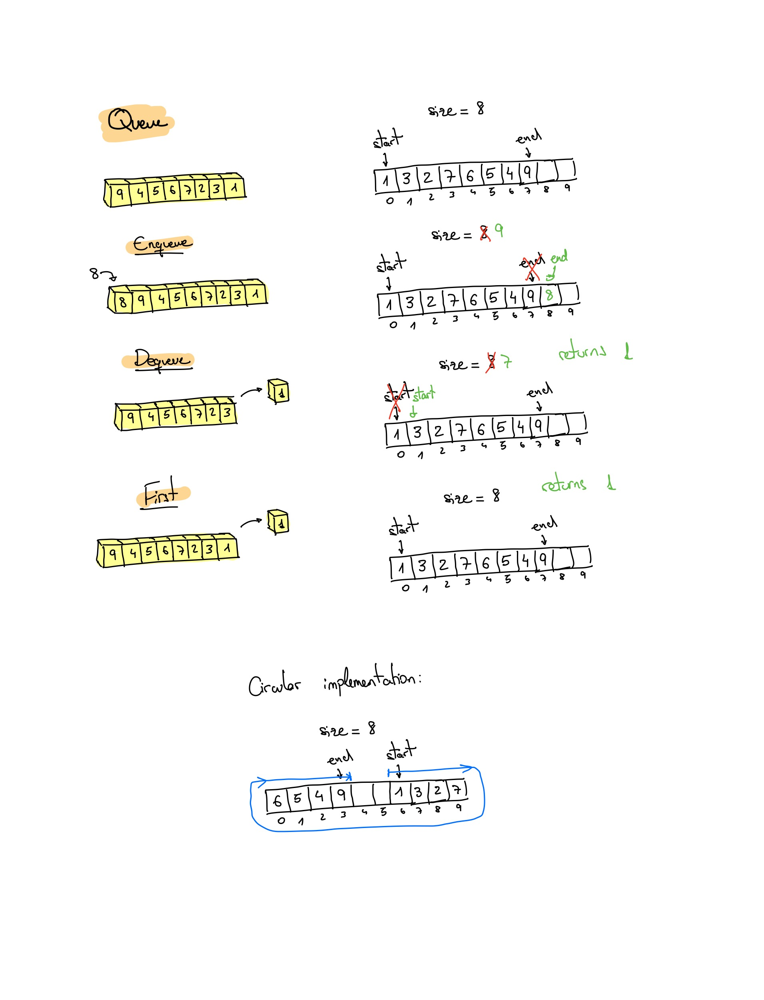
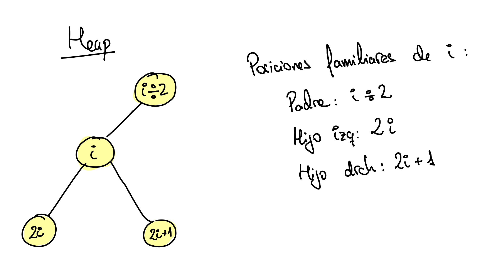

# Tema 2: Estructuras de datos

## Pilas

### Características

- Acceso limitado al último elemento insertado.
- Operaciones básicas: apilar, desapilar y cima (push, pop y top).
- Cada operación tarda O(1) independientemente del tamaño de la pila.

Representación de una pila:


### Pseudocódigo

```pseudo
tipo Pila = registro
    Cima_de_pila : 0..Tamaño_máximo_de_pila
    Vector_de_pila : vector [1..Tamaño_máximo_de_pila] de Tipo_de_elemento
fin registro

procedimiento Crear Pila (P)
    P.Cima_de_pila := 0
fin procedimiento

función Pila Vacía (P) : test
    devolver P.Cima_de_pila = 0
fin función

procedimiento Apilar (x, P)
    si P.Cima_de_pila = Tamaño_máximo_de_pila entonces
        error Pila llena
    sino
        P.Cima_de_pila := P.Cima_de_pila + 1
        P.Vector_de_pila[P.Cima_de_pila] := x
fin procedimiento

función Cima (P) : Tipo_de_elemento
    si Pila Vacía(P) entonces error Pila vacía
    sino devolver P.Vector_de_pila[P.Cima_de_pila]
fin función

procedimiento Desapilar (P)
    si Pila Vacía (P) entonces error Pila Vacía
    sino P.Cima_de_pila := P.Cima_de_pila - 1
fin procedimiento
```

### Implementación en C

```c
/* ------ headers ------- */
#define TAMANO_MAXIMO_PILA 10

typedef int tipo_elemento;
typedef struct {
    int cima;
    tipo_elemento vector[TAMANO_MAXIMO_PILA];
} pila;

void crear_pila(pila *);
int pila_vacia(pila);
void apilar(tipo_elemento, pila *);
tipo_elemento cima(pila);
void desapilar(pila *);

/* ERRORES: */
/*  -cima o desapilar sobre pila vacia */
/*  -apilar sobre la pila llena        */

/* ------ code ------- */
#include <stdlib.h>
#include <stdio.h>

void crear_pila(pila *p) {
    p->cima = -1;
}

int pila_vacia(pila p) {
    return (p.cima == -1);
}

void apilar(tipo_elemento x, pila *p) {
    if (++p->cima == TAMANO_MAXIMO_PILA) {
        printf("error: pila llena\n");
        exit(EXIT_FAILURE);
    }
    p->vector[p->cima] = x;
}

tipo_elemento cima(pila p) {
    if (pila_vacia(p)) {
        printf("error: pila vacía\n");
        exit(EXIT_FAILURE);
    }
    return p.vector[p.cima];
}

void desapilar(pila *p) {
    if (pila_vacia(*p)) {
        printf("error: pila vacía\n");
        exit(EXIT_FAILURE);
    }
    p->cima--;
}
```

## Colas

### Características

- Operaciones básicas: insertar, quitarPrimero y primero (enqueue, dequeue, first).
- Todas las operaciones en O(1).

Representación de una cola:



### Pseudocódigo

```pseudo
tipo Cola = registro
    Cabeza_de_cola, Final_de_cola: 1..Tamaño_máximo_de_cola
    Tamaño_de_cola: 0..Tamaño_máximo_de_cola
    Vector_de_cola: vector [1..Tamaño_máximo_de_cola] de Tipo_elemento
fin registro

procedimiento Crear_Cola (C)
    C.Tamaño_de_cola := 0
    C.Cabeza_de_cola := 1
    C.Final_de_cola := Tamaño_máximo_de_cola
fin procedimiento

función Cola Vacía (C) : test
    devolver C.Tamaño_de_cola = 0
fin función

procedimiento incrementar (x) /* privado */
    si x = Tamaño_máximo_de_cola entonces x := 1
    sino x := x + 1
fin procedimiento

procedimiento Insertar_en_Cola (x, C)
    si C.Tamaño_de_cola = Tamaño_máximo_de_cola entonces
        error Cola llena
    sino
        C.Tamaño_de_cola := C.Tamaño_de_cola + 1;
        incrementar(C.Final_de_cola)
        C.Vector_de_cola[C.Final_de_cola] := x
fin procedimiento

función Quitar_Primero (C) : Tipo_de_elemento
    si Cola Vacía(C) entonces
        error Cola vacía
    sino
        C.Tamaño_de_cola := C.Tamaño_de_cola - 1
        x := C.Vector_de_cola[C.Cabeza_de_cola]
        incrementar(C.Cabeza_de_cola)
        devolver x
fin función

función Primero (C) : Tipo_de_elemento
    si Cola_Vacía (C) entonces
        error Cola vacía
    sino
        devolver C.Vector_de_cola[C.Cabeza_de_cola]
fin función
```

### Implementación en C

```c
/* ------ headers ------- */
#define TAMANO_MAXIMO_COLA 5

typedef int tipo_elemento;
typedef struct {
    int cabeza, final, tamano;
    tipo_elemento vector[TAMANO_MAXIMO_COLA];
} cola;

void crear_cola(cola *);
int cola_vacia(c);
void insertar(tipo_elemento, cola *);
tipo_elemento quitar_primero(cola *);
tipo_elemento primero(cola);

/* ERRORES: */
/* -quitar_primero o primero sobre cola vacía */
/* - insertar en una cola llena               */

/* ------ code ------- */
#include <stdlib.h>
#include <stdio.h>

void crear_cola(cola *c) {
    c->tamano = 0;
    c->cabeza = 0;
    c->final = -1;
}

int cola_vacia(cola c) {
    return (c.tamano == 0);
}

void incrementar(int *x) {
    if (++(*x) == TAMANO_MAXIMO_COLA) {
        *x = 0;
    }
}

void insertar(tipo_elemento x, cola *c) {
    if (c->tamano == TAMANO_MAXIMO_COLA) {
        printf("error: cola llena %d\n", c->tamano);
        exit(EXIT_FAILURE);
    }
    c->tamano++;
    incrementar(&(c->final));
    c->vector[c->final] = x;
}

tipo_elemento primero(cola c) {
    if (cola_vacia(c)) {
        printf("error: cola vacía\n");
        exit(EXIT_FAILURE);
    }
    return (c.vector[c.cabeza]);
}

tipo_elemento quitar_primero(cola *c) {
    tipo_elemento x;
    if (cola_vacia(*c)) {
        printf("error: cola vacía\n");
        exit(EXIT_FAILURE);
    }
    c->tamano--;
    x = c->vector[c->cabeza];
    incrementar(&(c->cabeza));
    return x;
}
```

## Listas

### Características

- Operaciones básicas:
  - `Visualizar` su contenido.
  - `Buscar` la posición de la primera ocurrencia de un elemento.
  - `Insertar` y `Eliminar` un elemento en alguna posición
  - `Buscar_k_esimo`, que devuelve el elemento de la prosición indicada.
- Tiene que declararse el tamaño de la lista.
  - Exige sobrevaloración.
  - Consume mucho espacio.
- Complejidad computacional de las operaciones:
  - `Buscar_k_esimo`: O(1)
  - `Visualizar` y `Buscar`: O(n)
  - `Insertar` y `Eliminar`: Costoso, de media O(n).
    - Hay que ir yendo hasta la posición, de media n/2 -> O(n).
    - La construcción de una lista o la eliminación podría exigir un tiempo cuadrático.

Lista enlazada con punteros simple:


Insertar en esta lista:


Eliminar de esta lista:


Listas doblemente enlazadas:


Caracterísitcas de la lista doblemente enlazada:

- Cada nodo apunta al siguiente y al anterior.
- Duplica el uso de memoria de los punteros.
- Duplica el coste de manejo de punteros al insertar y eliminar.
- La eliminación se simplifica ya que no hay que buscar el anterior.

### Pseudocódigo

```pseudo
tipo PNodo = puntero a Nodo
tipo Lista = PNodo
tipo Posición = PNodo
tipo Nodo = registro
    Elemento : Tipo_de_elemento
    Siguiente : PNodo
fin registro

procedimiento Crear Lista (L)
    nuevo (tmp)
    si tmp = nil entonces
        error Memoria agotada
    sino
        tmp^.Elemento := { nodo cabecera }
        tmp^.Siguiente := nil
        L := tmp
fin procedimiento

función Lista Vacía (L) : test
    devolver L^.Siguiente = nil
fin función

función Buscar (x, L) : posición de la 1 ocurrencia o nil
    p := L^.Siguiente
    mientras p <> nil y p^.Elemento <> x hacer
        p := p^.Siguiente
    devolver p
fin función

función Último Elemento (p) : test { privada }
    devolver p^.Siguiente = nil
fin función

función Buscar Anterior (x, L) : posición anterior a x o nil { privada }
    p := L
    mientras p^.Siguiente <> nil y p^.Siguiente^.Elemento <> x hacer
        p := p^.Siguiente
    devolver p
fin función

procedimiento Eliminar (x, L)
    p := Buscar Anterior (x, L)
    si Último Elemento (p) entonces
        error No encontrado
    sino
        tmp := p^.siguiente
        p^.Siguiente := tmp^.Siguiente
        liberar tmp
fin procedimiento

procedimiento Insertar(x, L, p)
{ Inserta después de la posición p }
    nuevo tmp;
    si tmp = nil entonces
        error Memoria agotada
    sino
        tmp^.Elemento := x
        tmp^.Siguiente := p^.Siguiente
        p^.Siguiente := tmp
fin procedimiento
```

### Implementación en C

```c
/* ------ headers ------- */

struct nodo {
    void *elem;
    struct nodo *sig;
};

typedef struct nodo *posicion;
typedef struct nodo *lista;
lista crearlista();
int eslistavacia(lista l);
void insertar(void *e, posicion p); /* inserta e tras el nodo apuntado por p */
posicion buscar(lista l, void *e, int (*comp)(const void *x, const void *y)); /* comp función comparación, al poder tener varios tipos de elemento igual se comparan de forma diferente (idea prog. funcional) */
void borrar(lista l, void *e, int (*comp)(const void *x, const void *y));
posicion primero(lista l);
posicion sigiuente(posicion p);
int esfindelista(posicion p);
void *elemento(posicion p);

/*
Para recorrer lista:
for (p = primero(l); !esfindelista(p); p = siguiente(p)) {
    do_something(p);
}
*/

/* ------ code ------- */
#include <stdlib.h>
#include <stdio.h>

static struct nodo *crearnodo() {
    struct nodo *tmp = malloc(sizeof(struct nodo));
    if (tmp == NULL) {
        printf("Memoria agotada\n");
        exit(EXIT_FAILURE);
    }
    return tmp;
}

lista crearlista() {
    struct nodo *l = crearnodo();
    l->sig = NULL;
    return l;
}

int eslistavacia(lista l) {
    return (l->sig == NULL);
}

void insertar(void *x, posicion p) {
    struct nodo *tmp = crearnodo();
    tmp->elem = x;
    tmp->sig = p->sig;
    p->sig = tmp;
}

posicion buscar(lista l, void *e, int (*comp)(const void *x, const void *y)) {
    struct nodo *p = l->sig;
    while (p!= NULL && 0!=(*comp)(p->elem, e)) {
        p = p->sig;
    }
    return p;
}


static posicion buscarant(lista l, void *x, int (*comp)(const void *x, const void *y)) {
    struct nodo *p = l;
    while (p->sig != NULL && 0!=(*comp)(p->sig->elem, x)) {
        p = p->sig;
    }
    return p;
}

static int esultimoelemento(struct nodo *p) {
    return (p->sig == NULL);
}

void borrar(lista l, void *x, int (*comp)(const void *x, const void *y)) {
    struct nodo *tmp, *p = buscarant(l, x, comp);
    if (!esultimoelemento(p)) {
        tmp = p->sig;
        p->sig = tmp->sig;
        free(tmp);
    }
}

posicion primero(lista l) { return l->sig; }
posicion siguiente(posicion p) { return p->sig; }
int esfindelista(posicion p) { return p == NULL; }
void *elemento(posicion p) { return p->elem; }

/* ejemplo comparador de ints */
int intcmp(const void *a, const void *b) {
    int x = *(int *)a, y = *(int *)b;
    return (x - y);
}

```

## Árbol binario de búsqueda

- **Camino**: secuencia de nodos para llegar de uno a otro.
- **Profundidad**: longitud del camino entre un nodo y la raíz.
  - En un ABB, el valor medio de la profundidad es O(log n).
- **Altura**: es el camino más largo del nodo a una hoja.
- **Altura de un árbol**: es la altura de la raíz.


- Operaciones básicas:
  - `Buscar`: devuelve la posición del nodo con la clave buscada.
    
  - `Insertar`: coloca una clave.
    
  - `Eliminar`: borra una clave.
    - Si la clave está en una hoja, se elimina de inmediato.
    - Si el nodo tiene un hijo, se ajusta un puntero.
    - Si el nodo tiene 2 hijos, se sustituye la clave por la más pequeña del subárbol derecho.
    
    

> Si se espera que se haya pocas eliminaciones, la *eliminación perezosa* (*lazy delete*) es una buena estrategia. Se marca el elemento como borrado pero no se elimina el nodo. Se puede llevar un contador de apariciones si se esperan claves duplicadas.

```pseudo
tipo PNodo = ^Nodo
tipo nodo = registro
    Elemento : TipoElemento
    Izquierdo, Derecho : PNodo
fin registro
tipo ABB = PNodo

procedimiento CrearABB (var A)
    A := nil
fin procedimiento

función Buscar (x, A) : PNodo { caso medio: O(logn), peor: O(n) }
    si A = nil entonces devolver nil
    sino si x = A^.Elemento entonces devolver A
    sino si x < A^.Elemento entonces
        devolver Buscar (x, A^.Izquierdo)
    sino
        devolver Buscar (x, A^.Derecho)
fin función

función BuscarMin (A) : PNodo { caso medio: O(logn), peor: O(n) }
    si A = nil entonces devolver nil
    sino si A^.Izquierdo = nil entonces devolver A
    sino devolver BuscarMin (A^.Izquierdo)
fin función

procedimiento Insertar (x, var A) { caso medio: O(logn), peor: O(n) }
    si A = nil entonces
        nuevo (A);
        si A = nil entonces
            error Sin memoria
        sino
            A^.Elemento := x
            A^.Izquierdo := nil
            A^.Derecho := nil
    sino si x < A^.Elemento entonces
        Insertar(x, A^.Izquierdo)
    sino si x > A^.Elemento entonces
        Insertar(x, A^.Derecho)
    { si x = A^.Elemento : nada }
fin procedimiento

procedimiento Eliminar (x, var A)  { caso medio: O(logn), peor: O(n) }
    si A = nil entonces
        error No encontrado
    sino si x < A^.Elemento entonces
        Eliminar(x, A^.Izquierdo)
    sino si x > A^.Elemento entonces
        Eliminar(x, A^.Derecho)
    sino  { x = A^.Elemento }
        si A^.Izquierdo = nil entonces
            tmp := A
            A := A^.Derecho
            liberar(tmp)
        si A^.Derecho = nil entonces
            tmp := A
            A := A^.Izquierdo
            liberar(tmp)
        sino
            tmp := BuscarMin(A^.Derercho)
            A^.Elemento := tmp^.Elemento
            Eliminar(A^.Elemento, A^.Derecho)
fin procedimiento
```

### Recorridos árbol

En **orden** [O(n)]: se procesa el subárbol *izquierdo*, luego el nodo *actual* y, por último, el subárbol *derecho*.

```pseudo
procedimiento Visualizar (A)
    si A <> nil entonces
        Visualizar (A^.Izquierdo)
        Escribir (A^.Elemento)
        Visualizar (A^.Derecho)
fin procedimiento
```

**Post-orden** [O(n)]: Ambos subárboles primero.

```pseudo
función Altura (A) : número
    si A = nil entonces
        devolver -1
    sino
        devolver 1 + max(Altura(A^.Izquierdo), Altura(A^.Derecho))
fin función
```

**Pre-orden** [O(n)]: El nodo se procesa antes.

```pseudo
// TODO: función marca cada nodo con su profundidad
```

**Orden de nivel** [O(n)]: Todos los nodos con profundidad p se procesan antes que cualquier nodo con profundidad p+1.

```pseudo
procedimiento OrdenDeNivel (A)
    CrearCola(C)
    si A <> nil entonces InsertarEncola (A, C)
    mientras no ColaVacia(C) hacer
        p := QuitarPrimero(C)
        escribir(p^.Elemento) { Operación principal }
        si p^.Izq <> nil entonces InsertarEnCola(p^.Izq, C)
        si p^.Der <> nil entonces InsertarEnCola(p^.Der, C)
    fin mientras
fin procedimiento
```

## Montículos

### Características

- Permiten únicamente el acceso al mínimo (o máximo) elemento.
- Operaciones básicas: insertar y eliminarMin/Max.
- Comparaciones simples:
  - Listas enlazadas:
    - Insercciones la frente. O(1)
    - Eliminar recorriendo lista. O(n)
  - Lista ordenada:
    - Inserción costosa, hay que ponerlo en su sitio. O(n)
    - Eliminaciones eficientes. O(1)
  - Árboles binarios de búsqueda:
    - Tiempo medio: O(log n)
  - Montículos:
    - Peor caso: O(log n)
    - No requieren punteros.

Un montículo es un **árbol binario completo**, es decir, todos los niveles están llenos a excepción del nivel más bajo, que se llena de izquierda a derecha.

<!--
```latex
\text{Dado un arbol binario completo de altura h:}\\
2^h \le  \text{n nodos} \le 2^{h+1}-1\\
Altura = \vert log_2 n\vert
```
-->


Si estamos hablando de un montículo de mínimos, el mínimo del montículo siempre está en la raíz del árbol. Y como todo subárbol es también un montículo, todo nodo debe ser menor o igual que todos sus descendientes.

Dado un nodo en posición i, se pueden saber fácilmente las posiciones de sus *familiares*:



Representación de un montículo en un array:


### Pseudocódigo (máx.)

```pseudo
tipo Montículo = registro
    Tamaño_monticulo : 0..Tamaño_máximo
    Vector_montículo : vector [1..Tamaño_máximo] de Tipo_elemento
fin registro

procedimiento Inicializar_Montículo (M)
    M.Tamaño_monticulo := 0
fin procedimiento

función Montículo_Vacío (M) : test
    return M.Tamaño_montículo = 0
fin función

procedimiento Flotar (M, i) { privado }
    mientras i > i y M.Vector_montículo[i div 2] < M.Vector_montículo[i] hacer
        intercambiar M.Vector_montículo[i div 2] y M.Vector_montículo[i]
        i := i div 2
    fin mientras
fin procedimiento

procedimiento Insertar (x, M)
    si M.Tamaño_monticulo = Tamaño_máximo entonces
        error Montículo lleno
    sino
        M.Tamaño_montíulo := M.Tamaño_montículo + 1
        M.Vector_montículo[M.Tamaño_montículo] := x
        Flotar (M, M.Tamaño_montículo)
fin procedimiento

procedimiento Hundir (M, i) { privado }
    repetir
        HijoIzq := 2*i
        HijoDer := 2*i + 1
        j := i
        si HijoDer <= M.Tamaño_montículo y M.Vector_monticulo[HijoDer] > M.Vector_montículo[i] entonces
            i := HijoDer
        si HijoIzq <= M.Tamaño_monticulo y M.Vector_monticulo[HijoIzq] > M.Vector_montículo[i] entonces
            i := HijoIzq
        intercambiar M.Vector_montículo[j] y M.Vector_montículo[i]
    hasta j = i
fin procedimiento

función EliminarMax (M) : Tipo_elemento
    si Montículo_Vacío(M) entonces
        error Montículo vacío
    sino
        x := M.Vector_montículo[1]
        M.Vector_montículo[1] := M.Vector_montículo[M.Tamaño_montículo]
        si M.Tamaño_montículo > 0 entonces
            Hundir (M, 1)
        devolver x
fin función

/* CREACIÓN MONTÍCULOS EN TIEMPO LINEAL O(n) */
procedimiento Crear_Montículo(V[1..n], M)
    Copiar V en M.Vector_montículo
    M.Tamaño_montículo := n
    para i := M.tamaño_montículo div 2 hasta 1 paso -1
        Hundir (M, i)
    fin para
fin procedimiento
```

El número de intercambios está acotado por la suma de las alturas de los nodos. Lo podemos demostrar marcando las aristas máximas que nos puede llevar hundir/flotar cada uno de los elementos (n/2, se empiza en n div 2).

Aqui ejemplificamos como funciona el crear un montículo de mínimos desde un array ordenado descendentemente:


## Tablas de dispersión (tablas hash)

### Características

- Objetivo: realizar inserciones, eliminaciones y búsquedas en tiempo promedio constante O(1)
- Se usa para representar diccionarios, dada una clave se consigue su definición.
- Estructura de datos ideal:
  - Vector tamaño fijo N
  - Función de dispersión (establece correspondencia de cada clave con un número entre 0 y N-1)
  - Función fácil de calcular y que distribuya homogéneamente las claves.
  - Decidir:
    - Valor de N (número de celdas disponibles)
    - Que hacer en caso de colisión (dos valores en la misma celda)

> En las tablas de dispersión siempre es recomendable usar tamaños de la tabla primos.

#### Dispersión abierta


Pseudocódigo con lista enlazada:

```pseudo
tipo Índice = 0..N-1
tipo Posición = ^Nodo
tipo Lista = Posición
tipo Nodo = registro
    Elemento : TipoElemento
    Siguiente : Posición
fin registro
tipo TablaDispersión = vector [Índice] de Lista

procedimiento InicializarTabla (T)
    para i := 0 hasta N-1 hacer
        CrearLista(T[i])
    fin para
fin procedimiento

función Buscar (Elem, Tabla) : Posición
    i := Dispersión(Elem);
    devolver BuscarEnLista(Elem, Tabla[i])
fin función

procedimiento Insertar (Elem, Tabla)
    pos := Buscar(Elem, Tabla) { No inserta repetidos }
    si pos = nil entonces
        i := Dispersión(Elem)
        InsertarEnLista(Elem, Tabla[i])
fin procedimiento
```


#### Dispersión cerrada

De este modo todos los datos se guardan en la tabla, no hay listas (infinitas, mientras haya memoria). La tabla tiene entonces que ser mas grande. Lo ideal es un factor de carga λ < 1/2.

Las tablas con dispersión cerrada requieren eliminación perezosa (lazy delete) porque si borramos elementos, podemos no encontrar nunca otros que pasan a quedar fuera de sitio habiendo sitio antes.

Pseudocódigo:

```pseudo
tipo ClaseDeEntrada = (legítima, vacía, eliminada)
tipo Índice = 0..N-1
tipo Posición = Índice
tipo Entrada = registro
    Elemento : TipoElemento
    Información : ClaseDeEntrada
fin registro
tipo TablaDispersión = vector [Índice] de Entrada

procedimiento InicializarTabla (D)
    para i := hasta N-1 hacer
        D[i].Información := vacía
    fin para
fin procedimiento

/* Encuentra elementos legítimos o borrados */
función Buscar (Elem, D) : Posición
    i := 0
    x := Dispersión(Elem)
    PosActual := x
    mientras D[PosActual].Información <> vacía y P[PosActual].Elemento <> Elem hacer
        i := i + 1
        PosActual := (x + FunResoluciónColisión(x, i)) mod N
    fin mientras
    devolver PosActual
fin función

procedimiento Insertar (Elem, D)
    pos := Buscar(Elem, D)
    si D[pos].Infromación <> legítima entonces
        D[pos].Elemento := Elem
        D[pos].Información := legítima
fin procedimiento

procedimiento Eliminar(Elem, D)
    pos := Buscar(Elem, D)
    si D[pos].información = legítima
    entonces D[pos].Información := eliminada
fin procedimiento
```

La implementación de `FunResoluciónColisión` puede ser:

- Lineal: f(i) = i
- Cuadrática: f(i) = i^2
- Doble: f(i) = i * hash2(x)

## Grafos

Un grafo es un par G = (V, A)

- **V** es el conjunto de *vértices* (o nodos).
- **A** es el conjunto de *aristas*
  - Cada arista es un par (v, w) ∈ V
  - Si el par está ordenado, es un grafo dirigido.
- Representaciones de grafos dirigidos:
  - Matriz de adyacencia.
  - Listas de adyacencia.


### Matriz de adyacencia

- Matriz bidimensional (en el ejemplo llamada m)
- Cada arista (u, v) se representa como m[u, v] = 1, que indica que hay una arista, si el contenido es 0, no la hay.
- Si la arista tiene un peso asociado, se pone en m[u, v] el peso. Si no hay arista se usa una cifra muy grande o muy pequeña como centinela.
- Requerimiento de espacio: θ(|V|^2)
  - Adecuado para grafos densos
  - Prohibitivo para grafos dispersos


### Listas de adyacencia

- Para cada vértice metemos una lista con todos los vértices adyacentes.
  - Vector de listas de adyacencia.
- Requerimiento de espacio θ(|A| + |V|)
  - Buena solución para grafos dispersos.
- Si el grafo no es dirigido cada nodo aparecería duplicado.


## Conjuntos disjuntos

- Los elementos se numeran de 1 a n.
- Cada subconjunto tomará el nombre de uno de sus elementos, al que llamamos representante. Por ejemplo, el menor.
- En un vector se guarda el nombre del subconjunto disjunto de cada elemento.


Operaciones:

- `Búsqueda`: Devuelve el nombre del conjunto de un elemento.
- `Unión`: Combina dos subconjuntos en un subconjunto nuevo. Destruyéndose los originales.

### Pseudocódigo

```pseudo
tipo Elemento = entero
tipo Conj = entero
tipo ConjDisj = Vector [1..N] de entero

función Buscar1 (C, x) : Conj
    devolver C[x]
fin función
```

La función Buscar1 es una simple consulta O(1). Lo que importa es que si, y sólo si, dos búsquedas a `x` e a `y` devuelven el mismo resultado, entonces están en el mismo conjunto.

```pseudo
procedimiento Unir1 (C, a, b)
    i := min (C[a], C[b])
    j := max (C[a], C[b])
    para k := 1 hasta N hacer
        si C[k] = j entonces C[k] := i
    fin para
fin procedimiento
```

La unión toma O(n). No importa de que conjunto unamos ya que lo recorremos todo. Una secuencia de n - 1 uniones (la máxima) tomaría O(n^2).

La combinación de m búsquedas y n - 1 uniones toma O(m + n^2).

### Usando árboles

Utilizamos un árbol para caracterizar cada subconjunto.

- La raíz nombra al subconjunto.
- Fácil representación, puntero al padre.
- p[*i*] nos devuelve el padre de *i*.
- Si *i* es una raíz, p[*i*]=*i*.


```pseudo
función Buscar2 (C, x) : Conj
    r := x
    mientras C[r] <> r hacer
        r = c[r]
    fin mientras
    devolver r
fin función
```

En una búsqueda sobre el elemento x, se devuelve la raíz del arbol que contiene x.
La búsqueda de un elemento es proporcional a la profundidad del nodo x. En el peor caso puede ser O(n).

```pseudo
procedimiento Unir2 (C, raíz1, raíz2)
{ supone que son raíces }
    si raíz1 < raíz 2 entonces C[raíz2] := raiz1
    sino C[raíz1] := raíz2
fin procedimiento
```

La unión se efectúa combinando ambos árboles: la raíz de uno apunta a la raíz de otro. La unión toma O(1). La combinación de m búsquedas y n - 1 uniones ahora es O(m*n).


Una mejora sencilla es almacenar las alturas de los árboles y hacer del árbol menos profundo un subárbol del más profundo. La altura se incrementa, si y sólo si los dos árboles tienen el mismo tamaño.


```pseudo
procedimiento Unir3 (C, A, raíz1, raíz2)
    si A[raíz2] = A[raíz2] entonces
        A[raíz1] := A[raíz1] + 1
        C[raíz2] := raíz1
    sino si A[raíz1] > A[raíz2] entonces
        C[raíz2] := raíz1
    sino
        C[raíz1] := raíz2
fin procedimiento
```

Haciendo esto la profundidad de cualquier nodo nunca es mayor que log2(n). Todo nodo está inicialmente en profundidad 0. Cuando se incrementa la profundidad, se coloca en un árbol del doble de grande. Con lo cual la profundidad aumenta log2(n) veces a lo sumo.

De esta forma el tiempo de ejecución de una búsqueda es O(logn).
Combinando m búsquedas y n - 1 uniones, O(m * log(n) + n).

La compresión de caminos se ejecuta durante la búsqueda, cuando buscamos colocamos todos los nodos en el camino de x a la raíz en altura 1 (directamente con la raíz).

```pseudo
función Buscar3 (C, x) : Conj
    r := x
    mientras C[r] <> r hacer
        r := C[r]
    fin mientras
    i := x
    mientras i <> r hacer
        j := C[i]
        C[i] := r
        i := j
    fin mientras
    devolver r
fin función
```


