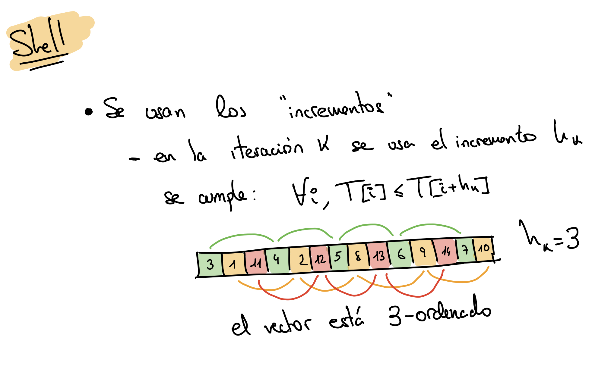
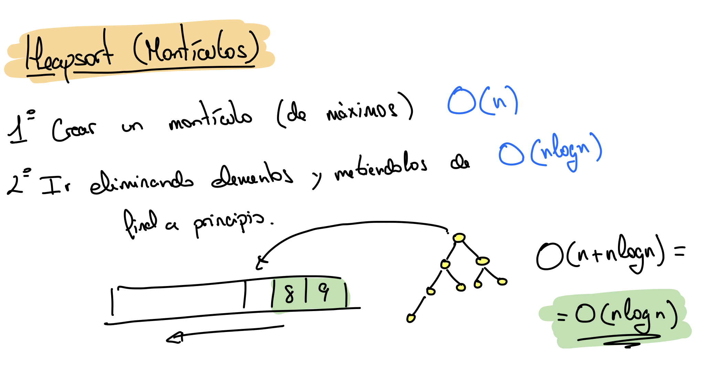
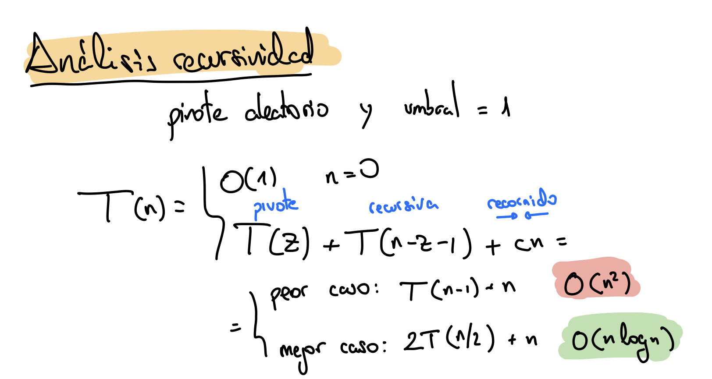

# Tema 3: Algoritmos sobre secuencias y conjuntos de datos

## Algoritmos de ordenación

### Ordenación por inserción


Pseudocódigo:

```pseudo
procedimiento Ordenación por Inserción (var T[1..n])
    para i := 2 hasta n hacer
        x := T[i]
        j := i - 1
        mientras j > 0 y T[j] > x hacer
            T[j+1] := T[j]
            j := j - 1
        fin mientras
        T[j+1] := x
    fin para
fin procedimiento
```

Implementación en C

```c
void insertion_sort(int arr[], int n) {
    int x, j, i;
    for (i = 0; i < n; i++) {
        x = arr[i];
        j = i - 1;
        while (j >= 0 && arr[j] > x) {
            arr[j + 1] = arr[j];
            j = j - 1;
        }
        arr[j + 1] = x;
    }
}
```

### Ordenación Shell



Pseudocódigo

```pseudo
procedimiento Ordenación de Shell (var T[1..n])
    incremento := n
    repetir
        incremento := incremento div 2 { otros incrementos aquí }
        para i := incremento + 1 hasta n hacer
            tmp := T[i]
            j := i
            seguir := cierto
            mientras j - incremento > 0 y seguir hacer
                si tmp < T[j - incremento] entonces
                    T[j] := T[j-incremento]
                    j := j - incremento
                sino seguir = falso
            T[j] := timp
    hasta incremento = 1
fin procedimiento
```

Implementación C

```c
void shell_sort(int arr[], int n) {
    int incremento = n, tmp, seguir, j, i;
    do {
        incremento = incremento / 2;
        for (i = incremento; i < n; i++) {
            tmp = arr[i];
            j = i;
            seguir = 1;
            while (j - incremento + 1 > 0 && seguir == 1) {
                if (tmp < arr[j - incremento]) {
                    arr[j] = arr[j - incremento];
                    j = j - incremento;
                } else { seguir = 0; }
            }
            arr[j] = tmp;
        }
    } while (incremento != 1);
}
```


### Ordenación por montículos



Pseudocódigo

```pseudo
procedimiento Ordenación por montículos (var T[1..n])
    Crear montículo (T, M)
    para i := 1 hasta n hacer
        T[n-i+1] := Obtener mayor (M)
        Eliminar mayor (M)
    fin para
fin procedimiento
```

### Ordenación por fusión


Pseudocódigo

```pseudo
procedimiento Fusión (var T[Izq..Dch], Centro: Izq..Dch)
    i := Izq
    j := Centro + 1
    k := Izq
    mientras i <= Centro y j <= Dch hacer
        si T[i] <= T[j] entonces
            Aux[k] := T[i]
            i := i + 1
        sino
            Aux[k] := T[j]
            j := j + 1
        k = k + 1
    mientras i <= Centro hacer
        Aux[k] := T[i]
        i := i + 1
        k := k + 1
    mientras j <= Dch hacer
        Aux[k] := T[j]
        j := j + 1
        k := k + 1
    para k := Izq hasta Dch hacer
        T[k] := Aux[k]
fin procedimiento
```

```pseudo
procedimiento Ordenación por Fusión Recursivo (var T[Izq..Dch])
    si Izq + UMBRAL < Dch entonces
        Centro := (Izq + Dch) div 2
        Ordenación por Fusión Recursivo (T[Izq..Centro])
        Ordenación por Fusión Recursivo (T[Centro + 1..Izq])
        Fusión (T[Izq..Dch], Centro)
    sino Ordenación por Inserción(T[Izq..Dch])
fin procedimiento

procedimiento Ordenación por Fusión (var T[1..n])
    Ordenación por Fusión Recursivo(T[1..n])
fin procedimiento
```

> TODO: mergesort c implementation

### Quicksort




Pseudocódigo selección pivote *Mediana 3*

```pseudo
procedimiento Mediana 3 (var T[i..j])
    centro := (i+j) div 2
    si T[i] > T[centro] entonces
        intercambiar T[i] y T[centro]
    si T[i] > T[j] entonces
        intercambiar T[i] y T[j]
    si T[centro] > T[j] entonces
        intercambiar T[centro] y T[j]
    intercambiar T[centro] y T[j - 1]
fin procedimiento
```

Pseudocódigo QuickSort mediana 3

```pseudo
procedimiento Qsort (var T[i..j])
    si i + UMBRAL <= j entonces
        Mediana 3 (T[i..j])
        pivote := T[j-1]
        k := i
        m := j - 1
        repetir
            repetir k := k + 1 hasta T[k] >= pivote
            repetir m := m - 1 hasta T[m] <= pivote
            intercambiar T[k] y T[m]
        hasta m <= k
        intercambiar T[k] y T[m] { deshacer último intercambio }
        intercambiar T[j] y T[j - 1] { colocar pivote }
        Qsort (T[i..j - 1])
        Qsort (T[k + 1..j])
fin procedimiento

procedimiento Quicksort (var T[1..n])
    Qsort (T[1..n])
    Ordenación por Inserción (T[1..n])
fin procedimiento
```

Implementación en C

```c
/* SELECCIÓN PIVOTE y INTERCAMBIAR */
/* UTILIDADES INTERNAS ALGORITMOS */

void intercambiar(int *x, int *y) {
    int aux = *x;
    *x = *y;
    *y = aux;
}

void mediana3(int V[], int i, int j) {
    int k = (i + j) / 2;
    if (V[k] > V[j]) intercambiar(&V[k], &V[j]);
    if (V[k] > V[i]) intercambiar(&V[k], &V[i]);
    if (V[i] > V[j]) intercambiar(&V[i], &V[j]);
}

/* Quick Sort */

void q_sort(int V[], int izq, int der) {
    int pivote, i, j;
    if (izq + UMBRAL <= der) {
        mediana3(V, izq, der);
        pivote = V[izq];
        i = izq;
        j = der;
        do {
            do { i++; } while (V[i] < pivote);
            do { j--; } while (V[j] > pivote);
            intercambiar(&V[i], &V[j]);
        } while (j > i);
        intercambiar(&V[i], &V[j]);
        intercambiar(&V[izq], &V[j]);
        q_sort(V, izq, j - 1);
        q_sort(V, j + 1, der);
    }
}

void quick_sort(int V[], int n) {
    q_sort(V, 0, n - 1);
    if (UMBRAL > 1) {
        insertion_sort(V, n);
    }
}
```
