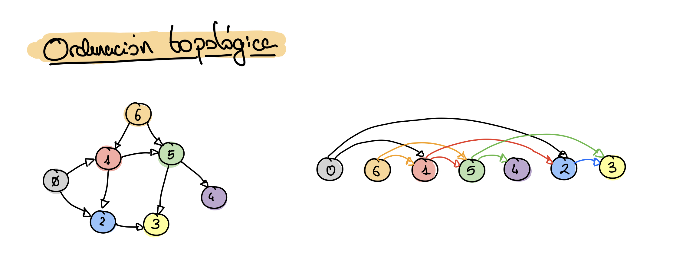
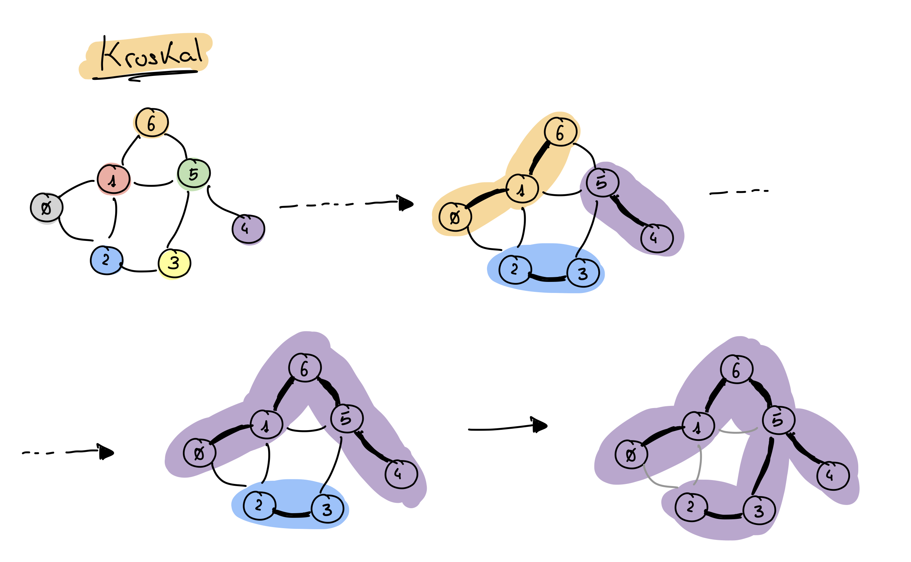
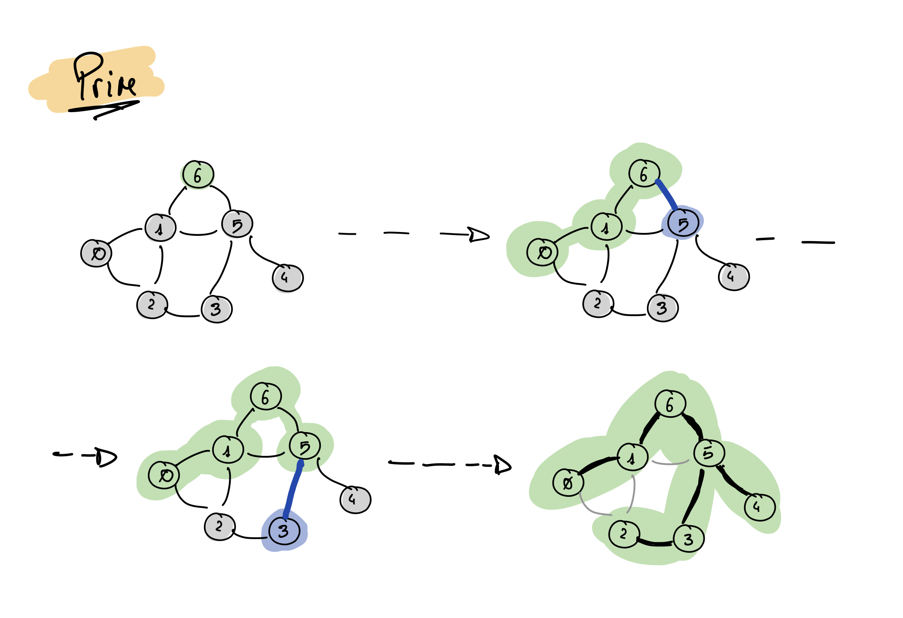
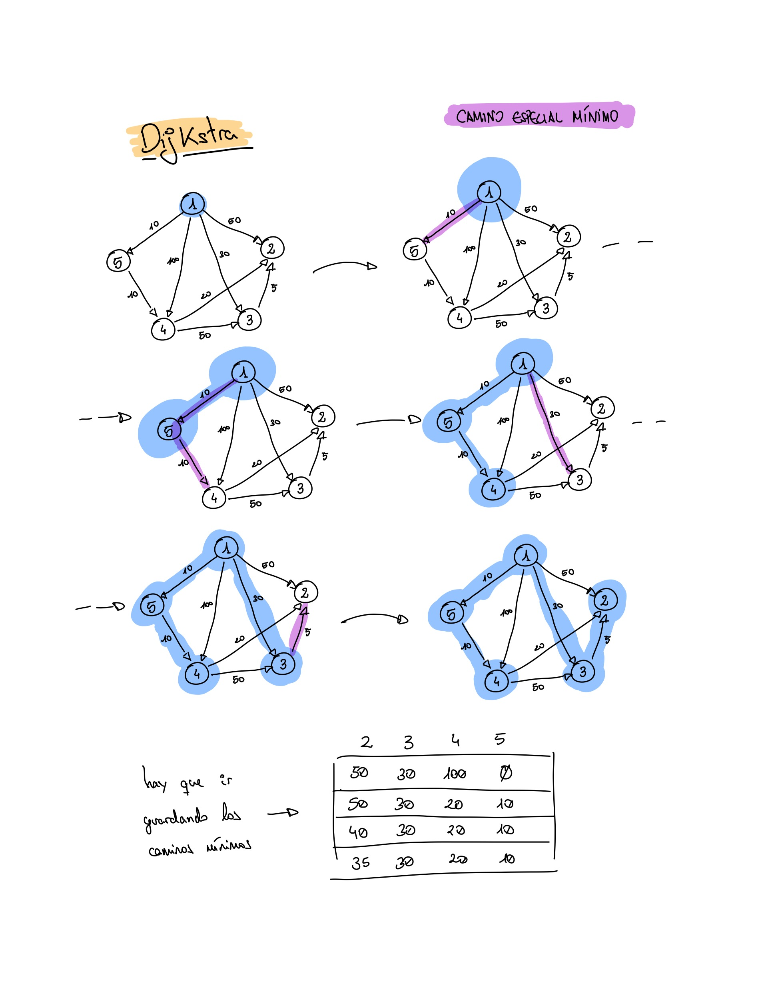

# Tema 4: Algoritmos voraces

Características

- Resuelven problemas de optimización
  - En cada fase toman una decisión, satisfaciendo un óptimo local, esperando en conjunto satisfacer un óptimo global.
- Manejan un conjunto de candidatos (C).
  - En cada fase, se retira un candidato de C y se incluye en la solución, si es factible.
- 4 Funciones
  - ¿S es Solución?
  - ¿S es Factible?
  - Selección (escoger candidato)
  - Objetivo (valora S, relacionado con Selección)

```pseudo
función voraz(C: conjunto) : conjunto
    { C es el conjunto de candidatos }
    S ← ∅ { Construimos la solución en S }
    mientras C ≠ ∅ y no solución(S) hacer
        x ← seleccionar (C)
        C ← C \ {x}
        si factible (S U {x}) entonces
            S ← S U {x}
    si solución (S) entonces
        devolver S
    sino
        devolver "no hay soluciones"
```

## El problema de la mochila

Si podemos fraccionar los elementos lo mejor es usar la rentabilidad de los objetos hasta llenar la mochila, partiendo por donde no entre más.

```pseudo
función Mochila 1 (w[1..n], v[1..n], W) : objetos [1..n]
    para i := 1 hasta n hacer
        x[i] := 0
    peso := 0
    mientras peso < W hacer
        i := mejor objeto restante  { mej. ej: montículo rentabilidades }
        si peso + w[i] <= W entonces
            x[i] := 1
            peso := peso + w[i]
        sino
            x[i] = (W - peso) / w[i]
            peso := W
        fin si
    fin mientras
    devolver x
fin función
```

> TODO: implementar mochila (fraccionando)

## Ordenación topológica

Definición:

> Ordenación de los nodos de un grafo dirigido acíclico:

<!--
```latex
\exists \text{ camino } v_i, ..., v_j \Rightarrow v_j \text{ aparece despues de } v_i
```
-->

)



- La ordenación topológica no es única.
- Aplicación: sistema de prerrequisitos (llaves), *x* debe hacerse antes de *y*.

```pseudo
función Ordenación topológica 2 (G: grafo) : orden [1..n]
    Grado Entrada [1..n] := Calcular Grado Entrada (G)
    para i := 1 hasta 1 hacer
        Número topológico [i] := 0
    Crear Cola (C)
    contador := 1
    para cada nodo v hacer
        si Grado Entrada[v] = 0 entonces
            Insertar Cola (v, C)
    mientras no Cola Vacía (C) hacer
        v := Eliminar Cola (C)
        Número topológico [v] := contador
        contador := contador + 1
        para cada w adyacente a v hacer
            Grado Entrada [w] := Grado Entrada[w] - 1
            si Grado Entrada [w] = 0 entonces
                InsertarCola (w, C)
    si contador <= n entonces
        devolver error "el grafo tiene un ciclo"
    sino
        devolver Número topológico
fin función
```

> TODO: implementar orden topológico

## Árbol de recubrimiento mínimo

De un grafo conexo, no dirigido, de pesos positivos en las aristas:
> Conseguir un subconjunto de aristas tal que los nodos sean los mismos y la suma de los pesos y el número de aristas sea lo mínimo.

### Kruskal

Se crea un bosque con un único árbol cada uno (cada nodo es un árbol), se van uniendo los árboles hasta formar un único árbol, el árbol de recubrimiento mínimo.



```pseudo
función Kruskal (G = (N,A) ) : árbol
    Ordenar A según longitudes crecientes
    n := |N|
    T := conjunto vacío
    inicializar n conjuntos, uno por nodo de N
    repetir
        a := (u, v) { arista más corta de A sin considerar }
        Conjunto U := Buscar(u)
        Conjunto V := Buscor(v)
        si Conjunto U <> Conjunto V entonces
            Fusionar (Conjunto U, Conjunto V)
            T := T U {a}
        fin si
    hasta |T| = n - 1
fin función
```

> TODO: implementar Kruskal
> TODO: implementar Kruskal (con montículo)

### Prim

A diferencia de Kruskal, este algoritmo empieza desde un nodo arbitrario y va incluyendo la arista que se encuentra a la distancia mínima de la *solución provisional*.



```pseudo
función Prim2 (L[1..n, 1..n]) : árbol
    Distancia mínima [1] := -1
    T := conjunto vacío
    para i := 2 hasta n hacer
        Mas próximo [i] := 1
        Distancia mínima [i] := L[i, 1]
    repetir n - 1 veces
        min := ∞
        para j := 2 hasta n hacer
            si 0 <= Distancia mínima [j] < min entonces
                min := Distancia mínima [j]
                k := j
        T := T U { (Distancia mínima[k], k) }    { se incluye la arista a la solución } 
        Distancia mínima [k] := -1
        para j := 2 hasta n hacer
            si L[j, k] < Distancia mínima [j] entonces
                Distancia mínima [j] := L[j, k]
                Más próximo [j] := k
    devolver T
fin función
```

Implementación en C devolviendo una cola de aristas:

```c
void prim(matriz m, int nodos, cola *aristas) {
/* calcular el árbol de recubrimiento mínimo devolviendo
las aristas del arbol en la cola ’aristas’ */
    int min, i, j, k;
    arista a;
    int *masProximo = (int *) malloc(nodos * sizeof(int));
    int *distanciaMinima = (int *) malloc(nodos * sizeof(int));
    crear_cola(aristas);
    distanciaMinima[0] = -1;
    for (i = 1; i < nodos; i++) {
        masProximo[i] = 0;
        distanciaMinima[i] = m[i][0];
    }

    for (i = 0; i < nodos - 1; i++) {       // Bucle Voraz
        min = INFINITO;
        for (j = 1; j < nodos; j++) {
            if ((0 <= distanciaMinima[j]) && (distanciaMinima[j] < min)) {
                min = distanciaMinima[j];
                k = j;
            }
        }
        a.x = masProximo[k];
        a.y = k;
        a.peso = m[a.x][a.y];
        insertar(a, aristas);
        distanciaMinima[k] = -1;
        for (j = 1; j < nodos; j++) {
            if (m[j][k] < distanciaMinima[j]) {
                distanciaMinima[j] = m[j][k];
                masProximo[j] = k;
            }
        }
    }
    free(masProximo);
    free(distanciaMinima);
}
```

### Complejidades

|                                | Prim Θ(n^2) | Kruskal O(mlogn) |
|--------------------------------|-------------|------------------|
| Grafo denso: m → n (n - 1) / 2 | Θ(n^2)      | O(n^2logn)       |
| Grafo disperso: m → n          | Θ(n^2)      | O(nlogn)         |

## Caminos mínimos

### Dijkstra

Encontrar los caminos mínimos entre el nodo origen (nodo 1) y los demás nodos de N.

```pseudo
función Dijkstra (L[1..n,1..n]) : vector[1..n]
    C := { 2, 3, 4, ..., n}
    para i := 2 hasta n hacer
        D[i] := L[1, i]
    repetir n - 2 veces
        v := nodo de C que minimiza D[v]
        C := C \ {v}
        para cada w en C hacer
            D[w] := min (D[w], D[v] + L[v, w])
    devolver D
fin función
```

> TODO: implementar dijkstra
> TODO: implementar dijkstra (con montículos)



### Complejidad

Normal: Θ(n^2)
Con montículos: O((m + n) log n)
