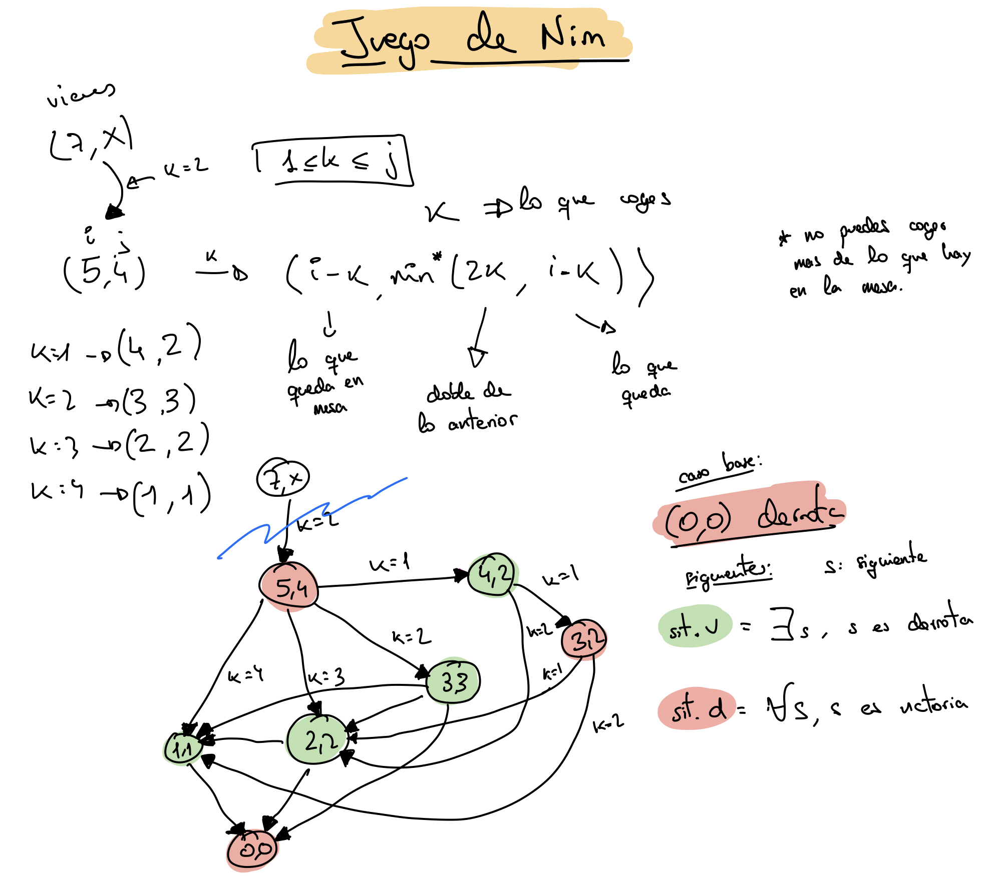

# Tema 6: Exploración de grafos

## Recorrido sobre grafos

> Lema: Para cada una de las técnicas de recorridos de árboles mencionadas, el tiempo T(n) que se necesita para explorar un árbol binario que contenga n nodos se encuentra en Θ(n).

### Recorrido en profundidad

Sea G = (N, A) un grafo no dirigido formado por todos aquellos nodos que deseamos visitar. Supongamos que de alguna manera es posible marcar un nodo para mostrar que ya ha sido visitado.
Para efectuar un recorrido en profundidad del grafo, se selecciona cualquier nodo *v* ∈ N como punto de partida. Se marca este nodo para mostrar que ya ha sido visitado. A continuacion, si hay un nodo adyacente a *v* que no haya sido visitado todavia, se toma este nodo como nuevo punto de partida y se invoca recursivamente al procedimiento de recorrido en profundidad. Al volver de la llamada recursiva, si hay otro nodo adyacente a o que no haya sido visitado, se toma este nodo como punto de partida siguiente, se vuelve a llamar recursivamente al procedimiento, y asi sucesivamente. Cuando están marcados todos los nodos adyacentes a *v*, el recorrido que comenzara en *v* ha finalizado. Si queda algún nodo de G que no haya sido visitado, tomamos cualquiera de ellos como nuevo punto de partida, y volvemos a invocar el procedimiento. Se sigue así hasta que estén marcados todos los nodos de G.

Se considera **naturalmente recursivo**.

```pseudo
procedimiento recorridop (G)
    para cada v ∈ N hacer
        marca[v] := no visitado
    para cada v ∈ N hacer
        si marca[v] ≠ visitado entonces
            rp(v)

procedimiento rp(v)
    marca[v] := visitado
    para cada nodo adyacente a v hacer
        si marca[w] ≠ visitado entonces rp(w)
```

> Se llama recorrido en profundidad porque va hacia dentro todo lo que puede antes de retroceder.

¿Cuánto tiempo se necesita para explorar un grafo con n nodos y a aristas? Θ(n) para las llamadas y Θ(a) para inspeccionar las marcas. Por lo tanto el tiempo está en Θ(máx(a, n)).

Para marcar el orden podemos añadir al prinicpio del procedimiento `rp` lo siguiente:

```pseudo
num := num + 1
preorden[v] := num
```

Para hacerlo sobre un grafo dirigido, tan solo hay que definir bien el término **adyacente**. Aunque G sea conexo, puede formar un bosque en vez de un árbol.

Ejemplo de orden topológica (sobre un grafo dirigido acíclico):

- Añadir al final de `rp`: `escribir (v)` (e invertir el resultado)

Versión no recursiva:

```pseudo
procedimiento rp2 (v)
    P := pila vacía
    marca[v] := visitado
    mientras P no esté vacío hacer
        mientras exista un nodo w adyacente a cima (P) y marca[w] ≠ visitado hacer
            marca[w] := visitado
            apilar w en P
        desapilar P
```

### Recorrido en anchura

El recorrido en anchura, en cambio, ya no es naturalmente recursivo. Primero se visita todos los nodos adyacentes, antes de moverse.

```pseudo
procedimiento ra (v) 
    Q := cola vacía
    marca[v] := visitado
    poner v en Q
    mientras Q no esté vacío hacer
        u := primero (Q)
        quitar u de Q
        para cada nodo w adyacente a u hacer
            si marca[w] ≠ visitado entonces
                marca[w] := visitado
                poner w en Q
```

Interpretando correctamente el término **adyacente** funciona también para grafos dirigidos.

El tiempo requerido por un recorrido en anchura es del mismo orden que el requerido por un recorrido en profundidad: Θ(máx(a, n)).

El recorrido en anchura se emplea especialmente cuando haya que efectuar una exploración parcial de un grafo infinito (o tan grande que no resulte manejable), o para hallar el camino más corto desde un punto de un grafo hasta otro.

Si el grafo es conexo, también nos da un árbol de recubrimiento.

## Juego de Nim

Consideremos el juego siguiente. Se trata de una de las muchas variates de Nim, que también se conoce con el nombre de juego de Marienbad. Inicialmente, hay un montón de cerillas en la mesa, entre los dos jugadores. El primer jugador puede quitar tantas cerillas como desee, salvo que tine que tomar una como mínimo, y debe dejar una como mínimo. En el montón inicial tiene que haber un mínimo de dos cerillas. En lo sucesivo, el jugador al que corresponda el turno tiene que tomar como mínimo una cerilla, y como máximo el doble del número de cerillas que acaba de tomar su contrincante. Gana el jugador que se quede con la última cerilla. No hay empates.

Grafo:

- Nodo: situación: (quedan i, se pueden coger j)
- Arista: jugada (nº palillos)

Dos tipos de nodos:

- Situación de derrota
- Situación de victoria (victoria segura si juego bien)

Reglas para marcar desde (0, 0):

- Marcar *situación de victoria*: si existe un sucesor *situación de derrota*.
- Marcar *situación de derrota*: si todos los sucesores son *situación de victoria*.



```pseudo
función ganarec(i, j)
    para k := 1 hasta j hacer
        si no ganarec(i - k, min (2k, i - k)) entonces
            devolver verdadero
    devolver falso
```

Este algoritmo tiene los mismos defectos que *fibrec* (y otros), calcula varias veces los mismos valores.

Para solucionarlo podemos usar programación dinámica:

```pseudo
procedimiento ganadin(n)
    G[0, 0] := falso
    para i := 1 hasta n hacer
        para j := 1 hasta i hacer
            k := 1
            mientras k < j y G[i - k, min(2k, i- k)] hacer
                k := k + 1
            G[i, j] := no G[i - k, 2k, i - k]
```

De esta otra forma lo que pasa es que calculamos de forma innecesaria algunos valores de la matriz (hay partes de la tabla que no nos hacen falta).

Para mezclar las dos soluciones podemos usar lo que llamamos función con memoria:

Inicializamos el vector *conocido*:

```pseudo
para i := 1 hasta n hacer
    para j := 1 hasta i hacer
        conocido[i, j] := falso
```

> Con escribir media matriz llega, por que no se pueden coger más palillos de los que hay en la mesa, es decir, *j* nunca es mayor que *i*.

Determinamos si la situación es ganadora:

```pseudo
función nim(i, j)
    si conocido[i, j] entonces
        devolver G[i, j]
    conocido[i, j] = verdadero
    para k := 1 hasta j hacer
        si no ganarec(i - k, min (2k, i - k)) entonces
            G[i, j] := verdadero
            devolver verdadero
    G[i, j] := falso
    devolver falso
```

## Las 8 reinas (Vuelta atrás / Backtracking)

Recorrido implícito, se va recorriendo el grafo a medida que se va avanzando (pensemos en recorrido en profundidad).

Ante una solución encontrada hay que decidir que hacer:

- Seguir buscando soluciones
  - A veces hay que tomar decisiones, puede haber más soluciones en este camino o ya no puede haber más...
- Detenerse

Si hay un fallo, se vuelve atrás y se intenta en el primer nodo que tenga vecinos sin explorar.

```pseudo
procedimiento reinas(k, col, diag45, diag135)
    {
        sol[1..k] es k-prometedor
        col = {sol[i] | 1 <= i <= k}
        diag45 = {sol[i] - i + 1 | 1 <= i <= k}
        diag135 = {sol[i] + i - 1 | 1 <= i <= k}
    }
    si k = 8 entonces
        escribir sol
    sino
        para j := 1 hasta 8 hacer
            si j ∉ col y j - k ∉ diag45 y j + k ∉ diag135 entonces
                sol[k + 1] := j
                reinas(k + 1, col U {j}, diag45 U {j - k}, diag135 U {j + k})
```
